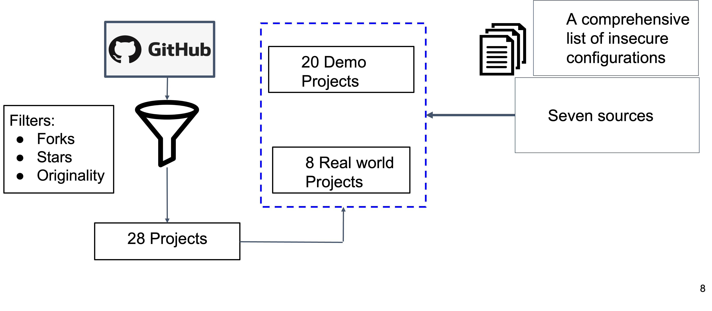

# Insecurities-spring-security

## Background and Motivation 
Spring security is tremendously popular among
practitioners for its ease of use to secure enterprise applications.
In this work, we present the application framework misconfiguration vulnerabilities in the light of Spring security, and ask 

> What are the common security anti-patterns/insecure defaults present in enterprise Spring security applications?

This repository contains a summary of the results. For more details, we refer the reader to our conference paper published at IEEE SecDev 2020 titled ["Coding Practices and Recommendations of Spring
Security for Enterprise Applications"](https://pages.cs.wisc.edu/~mazharul/files/IslamCoding.pdf)

## Methodology
<div align="center">
    
</div>

To find answers, we took a measurement-based approach.
We manually analyzed 28 Spring-based applications hosted
on GitHub to observe any insecure customization (i.e., security anti-patterns) of Spring security’s i) authentication
and ii) protection against exploits features. We also studied
the security of the default configurations of these features.

The list of 28 Spring-based applications we analyzed is available [here](https://docs.google.com/spreadsheets/d/1VTY_g-BDjxygV-yQzQ9lBQjWhJSrEVVivq1B2LP0nL4/edit?usp=sharing)

## Results 
<div align="center">
    
</div>
Our analysis discovered 6 types of security anti-patterns. We
observed that programmers tend to intentionally disable CSRF
protections, store secrets insecurely, use lifelong expiration of
access tokens, etc. Our analysis of Spring security’s default
configuration revealed 4 major vulnerabilities.
Our proposed changes contributed two security fixes to Spring Security fixes as we explained below.

## Four insecure defaults

<details>
  <summary>Using `BCrypt` with insecure strength</summary>

``` java 
    @Bean
    public PasswordEncoder passwordEncoder() {
        return new BCryptoPasswordEncoder(); 
        /* using default strength 10 is vulnerable to feasible brute for attacks */
    }
```
<div align="center">
    
</div>


</details>

<details>
  <summary>Using weak hash algorithm MD5</summary>
  MD5 is already a broken hashing algorithm. It is vulnerable to
  collision attacks, modular differential attacks. 

  ``` java 
   based64 (username + ":" + expirationTime + ":" + 
   md5Hex(username + ":" + expirationTime + 
   /* Use of weak hashing algortihm MD5 */
   ":" password + ":" + key))
  ```
  
</details>

<details>
  <summary>Lack of required throttling policy</summary>
  Resource management policy for web API need to have a proper throttling policy per user to prevent DoS/DDoS attack.

  <span style="color:red">Spring security framework lacks throttling policy.
  </span>
  
</details>

<details>
  <summary>Absence of content security policy (CSP) header</summary>
  CSP helps the developers to enforce a fine-grained security policy easily to prevent code injection attacks e.g., cross site scripting, clickjacking, and data injection, etc.

  <span style="color:red">Spring security does not add content security policy (CSP) HTTP headers by default.</span>
  
  
</details>

## Six security anti-patterns
<details>
  <summary>Life long valid access tokens</summary>
  MD5 is already a broken hashing algorithm. It is vulnerable to
  collision attacks, modular differential attacks. 

  ``` java 
  app:
  auth:
    tokenExpirationMsec: 864000000 
    // setting unnecessary long lifetime of 10 days
  ```
  <span style="color:red">Life long valid access tokens to reply attacks, leaks</span>
</details>

<details><summary>Absence of state param in oAuth 2.0</summary> 
  
  ``` java 
  public String getToken(@RequestParam String code) {
    ... 
    params.add("grant_type", "authorization_code");
    params.add("code", code)
    params.add("client_id", "aiqiyi")
    params.add("client_secret", "secret");
    params.add("state", 12124123234324)
    // ramdomly generated value of state param
  }
  ```
State-params stops against CSRF attacks
</details>

<details>
<summary>Fixed secrets to sign JWT tokens
</summary>
<span style="color:red">Hardcoded JWT keys is vulnerable to brute force attacks, and leaks
</span>
</details>

<details>
<summary>Disabling CSRF protection
</summary>
</details>

<details>
<summary>Fixed secrets to sign JWT tokens
</summary>
</details>

<details>
<summary>Storing secrets in insecure places.
</summary>
</details>

<details>
<summary>Not using TLS
</summary>
</details>


## Citation
If you use findings of this study in your research, please cite the following publication.
```
@INPROCEEDINGS {Spring-security,
author = {M. Islam and S. Rahaman and N. Meng and B. Hassanshahi and P. Krishnan and D. Yao},
booktitle = {2020 IEEE Secure Development (SecDev)},
title = {Coding Practices and Recommendations of Spring Security for Enterprise Applications},
year = {2020},
volume = {},
issn = {},
pages = {49-57},
keywords = {security;springs;authentication;uniform resource locators;password;encoding;authorization},
doi = {10.1109/SecDev45635.2020.00024},
url = {https://doi.ieeecomputersociety.org/10.1109/SecDev45635.2020.00024},
publisher = {IEEE Computer Society},
address = {Los Alamitos, CA, USA},
month = {sep}
}

```

